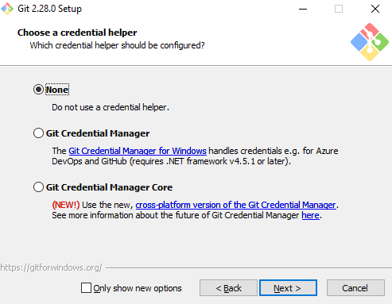

# Installing Git

> Note: This guide is meant for Windows 10 users.

There are many ways one can go about installing Git on a Windows machine. 

Examples include:

- downloading the [windows installer](https://github.com/git-for-windows/git/releases/download/v2.28.0.windows.1/Git-2.28.0-64-bit.exe) for your machine from [The Git Website](https://git-scm.com/) and running the installer locally,
- building from [source](https://github.com/git-for-windows/git/releases/tag/v2.28.0.windows.1),
- installing from command line or powershell,
- [installing via make](https://github.com/git-for-windows/git/blob/main/INSTALL),
- or installing via a command line utility library such as scoop or chocolatey.

How you install Git should be tailored to what you are comfortable with, which for most people is simply downloading the installer from Git's website and running it locally from your machine:

- Visit https://git-scm.com/downloads
- Click on Windows 
- Select the installer based on your system's configuration:
  - Operating System
  - Portable or "thumbdrive edition"
  - Full installation
  - 64-bit Architecture
  - 32-bit Architecture

Some Notes:

- Note that this is a project called Git for Windows, which is separate from Git itself; for more information on it, go to [https://gitforwindows.org](https://gitforwindows.org/).

- To get an automated installation you can use the [Git Chocolatey package](https://chocolatey.org/packages/git). Note that the Chocolatey package is community maintained.

- Another easy way to get Git installed is by installing GitHub Desktop. The installer includes a command line version of Git as well as the GUI. It also works well with PowerShell, and sets up solid credential caching and sane CRLF settings. We’ll learn more about those things a little later, but suffice it to say they’re things you want. You can download this from the [GitHub Desktop website](https://desktop.github.com/).

## Windows Installation Tips

On windows you want to configure your setup slightly different from other OS's due to the usage of **Windows Credential Manager, System and User Environment Variable Paths, and SSH/GPG integrations.**

Some tips to follow include:

- During installation do not select the option for using Windows Credential Manager as this brings annoyances later on which verifying credentials associated with any remote repository hosting platforms such as GitHub or BitBucket.



> Note I have not tried the **NEW** Cross-Platform version of the Git Credential Manager yet.

### Installation ScreenShots

Here is a collage of each step and the settings I select when downloading/updating Git for Windows:


### Installing from Source

Some people may instead find it useful to install Git from source, because you’ll get the most recent version. The binary installers tend to be a bit behind, though as Git has matured in recent years, this has made less of a difference.

If you do want to install Git from source, you need to have the following libraries that Git depends on: autotools, curl, zlib, openssl, expat, and libiconv. For example, if you’re on a system that has `dnf` (such as Fedora) or `apt-get` (such as a Debian-based system), you can use one of these commands to install the minimal dependencies for compiling and installing the Git binaries:

```console
$ sudo dnf install dh-autoreconf curl-devel expat-devel gettext-devel \
  openssl-devel perl-devel zlib-devel
$ sudo apt-get install dh-autoreconf libcurl4-gnutls-dev libexpat1-dev \
  gettext libz-dev libssl-dev
```

In order to be able to add the documentation in various formats (doc, html, info), these additional dependencies are required:

```console
$ sudo dnf install asciidoc xmlto docbook2X
$ sudo apt-get install asciidoc xmlto docbook2x
```

## Git Dependencies

From the Git for Windows INSTALL guide:

```
Git is reasonably self-sufficient, but does depend on a few external
   programs and libraries.  Git can be used without most of them by adding
   the appropriate "NO_<LIBRARY>=YesPlease" to the make command line or
   config.mak file.

	- "zlib", the compression library. Git won't build without it.

	- "ssh" is used to push and pull over the net.

	- A POSIX-compliant shell is required to run some scripts needed
	  for everyday use (e.g. "bisect", "request-pull").

	- "Perl" version 5.8 or later is needed to use some of the
	  features (e.g. preparing a partial commit using "git add -i/-p",
	  interacting with svn repositories with "git svn").  If you can
	  live without these, use NO_PERL.  Note that recent releases of
	  Redhat/Fedora are reported to ship Perl binary package with some
	  core modules stripped away (see http://lwn.net/Articles/477234/),
	  so you might need to install additional packages other than Perl
	  itself, e.g. Digest::MD5, File::Spec, File::Temp, Net::Domain,
	  Net::SMTP, and Time::HiRes.

	- git-imap-send needs the OpenSSL library to talk IMAP over SSL if
	  you are using libcurl older than 7.34.0.  Otherwise you can use
	  NO_OPENSSL without losing git-imap-send.

	  By default, git uses OpenSSL for SHA1 but it will use its own
	  library (inspired by Mozilla's) with either NO_OPENSSL or
	  BLK_SHA1.  Also included is a version optimized for PowerPC
	  (PPC_SHA1).

	- "libcurl" library is used by git-http-fetch, git-fetch, and, if
	  the curl version >= 7.34.0, for git-imap-send.  You might also
	  want the "curl" executable for debugging purposes. If you do not
	  use http:// or https:// repositories, and do not want to put
	  patches into an IMAP mailbox, you do not have to have them
	  (use NO_CURL).

	- "expat" library; git-http-push uses it for remote lock
	  management over DAV.  Similar to "curl" above, this is optional
	  (with NO_EXPAT).

	- "wish", the Tcl/Tk windowing shell is used in gitk to show the
	  history graphically, and in git-gui.  If you don't want gitk or
	  git-gui, you can use NO_TCLTK.

	- A gettext library is used by default for localizing Git. The
	  primary target is GNU libintl, but the Solaris gettext
	  implementation also works.

	  We need a gettext.h on the system for C code, gettext.sh (or
	  Solaris gettext(1)) for shell scripts, and libintl-perl for Perl
	  programs.

	  Set NO_GETTEXT to disable localization support and make Git only
	  use English. Under autoconf the configure script will do this
	  automatically if it can't find libintl on the system.

	- Python version 2.4 or later (but not 3.x, which is not
	  supported by Perforce) is needed to use the git-p4 interface
	  to Perforce.
```

## Installing a GUI

Visit https://git-scm.com/download/gui/windows for a listing of options here.

I also have a listing under [resources](../resources.md).

